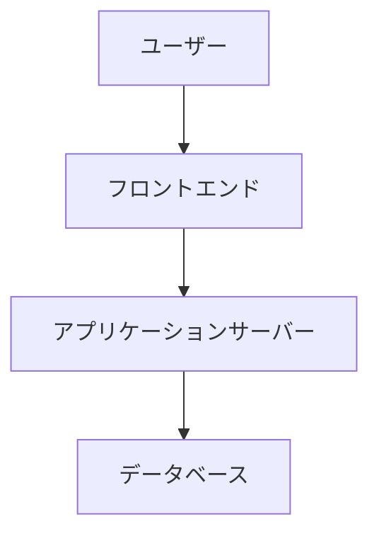

# IT評価・提案テンプレート

---

## ヘッダー情報

| 項目 | 内容 |
|---|---|
| ドキュメント名 | （例: POSシステム刷新提案書） |
| 作成日 | yyyy/mm/dd |
| 作成者 | （エージェント名） |
| 分類 | システム導入 / インフラ変更 / セキュリティ対策 / 障害報告 / 技術検証 |
| 優先度 | Critical / High / Medium / Low |

---

## 1. エグゼクティブサマリー

**結論**: （1〜2文で結論を記載）

**推奨アクション**:
- （アクション1）
- （アクション2）

---

## 2. 背景・目的

### 現状の課題
- （課題1）
- （課題2）

### 目的・ゴール
- （目的1）
- （目的2）

---

## 3. 提案内容

### 概要
（提案の全体概要を記述）

### システム構成図

### 機能要件
| # | 要件 | 優先度 | 備考 |
|---|---|---|---|
| 1 | | Must/Should/Could | |
| 2 | | Must/Should/Could | |

### 非機能要件
| 項目 | 要件 |
|---|---|
| 可用性 | （例: SLA 99.9%） |
| 性能 | （例: レスポンス2秒以内） |
| セキュリティ | （例: 通信暗号化、アクセス制御） |
| 拡張性 | （例: ユーザー数3倍まで対応） |

---

## 4. 技術選定

| 項目 | 候補A | 候補B | 候補C |
|---|---|---|---|
| 製品名 | | | |
| ベンダー | | | |
| ライセンス費用 | | | |
| 運用コスト | | | |
| 導入実績 | | | |
| 拡張性 | | | |
| セキュリティ | | | |
| **総合評価** | | | |

**推奨**: 候補X（選定理由を記載）

---

## 5. コスト分析（TCO: 5年間）

| 費用項目 | 初年度 | 2年目 | 3年目 | 4年目 | 5年目 | 合計 |
|---|---|---|---|---|---|---|
| 初期導入費 | | - | - | - | - | |
| ライセンス費 | | | | | | |
| 運用保守費 | | | | | | |
| インフラ費 | | | | | | |
| 人件費 | | | | | | |
| **合計** | | | | | | |

**ROI試算**: （投資対効果の試算を記載）

---

## 6. スケジュール

| フェーズ | 期間 | 主要タスク | 担当 |
|---|---|---|---|
| 要件定義 | yyyy/mm 〜 yyyy/mm | | |
| 設計 | yyyy/mm 〜 yyyy/mm | | |
| 開発・構築 | yyyy/mm 〜 yyyy/mm | | |
| テスト | yyyy/mm 〜 yyyy/mm | | |
| 移行・本番稼働 | yyyy/mm 〜 yyyy/mm | | |

---

## 7. リスク分析

| # | リスク | 発生可能性 | 影響度 | 対策 |
|---|---|---|---|---|
| 1 | | High/Med/Low | High/Med/Low | |
| 2 | | High/Med/Low | High/Med/Low | |

---

## 8. セキュリティ考慮事項

- [ ] 情報分類レベルの確認（Level 1〜4）
- [ ] アクセス制御の設計
- [ ] 暗号化要件の確認
- [ ] ログ・監査要件の確認
- [ ] バックアップ・DR要件の確認
- [ ] セキュリティテストの計画

---

## フッター

| 項目 | 内容 |
|---|---|
| レビュー者 | （品質レビュー部エージェント名） |
| レビュー日 | yyyy/mm/dd |
| 承認者 | 統括部長 |
